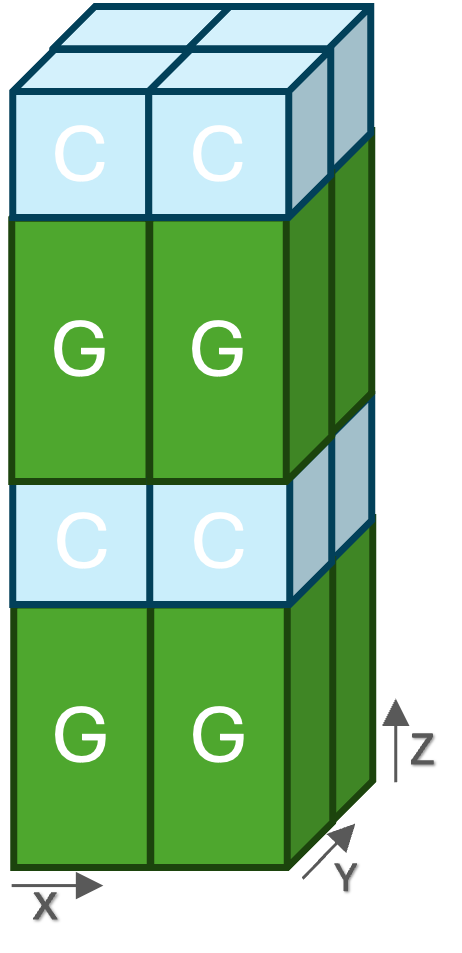

# NVIDIA High Performance Conjugate Gradient Benchmark (HPCG)


NVIDIA HPCG is based on the [HPCG](https://github.com/hpcg-benchmark/hpcg) benchmark and optimized for performance on NVIDIA accelerated HPC systems.

NVIDIA's HPCG benchmark accelerates the High Performance Conjugate Gradients (HPCG) Benchmark. HPCG is a software package that performs a fixed number of multigrid preconditioned (using a symmetric Gauss-Seidel smoother) conjugate gradient (PCG) iterations using double precision (64 bit) floating point values.

## Main Features
* The NVIDIA HPCG benchmark exploits NVIDIA high-performance math libraries: [cuSPARSE](https://docs.nvidia.com/cuda/cusparse/) and [NVPL Sparse](https://docs.nvidia.com/nvpl/_static/sparse/index.html) to achieve the highest possible performance for Sparse Matrix-vector multiplication (SpMV) and Sparse Matrix triangular solvers (SpSV) on NVIDIA GPUs and Grace CPUs.

* The NVIDIA HPCG benchmark supports highly configurable command line parameters to decide:
    * Problem sizes for the GPU and Grace CPU
    * 3D rank grid shape
    * Execution modes: CPU-only, GPU-only and heterogeneous
    * Point-to-point communication: MPI_Host (Send/Recv), MPI_Host_Alltoallv, MPI_CUDA_Aware, MPI_CUDA_Aware_Alltoallv, and NCCL
    * NUMA-related configurations

    See `bin/RUNNING-x86` and `bin/RUNNING-aarch64` for detailed description.
* The supported sparse storage format in the NVIDIA HPCG benchmark is the standard [sliced-ELLPACK format (SELL)](https://docs.nvidia.com/cuda/cusparse/#sliced-ellpack-sell).

## Supported Platforms
* The NVIDIA HPCG benchmark supports GPU-only execution on x86 and NVIDIA Grace CPU systems with NVIDIA Ampere GPU architecture (sm80) and NVIDIA Hopper GPU architecture (sm90), CPU only execution for NVIDIA Grace CPUs, and heterogeneous GPU-Grace execution for NVIDIA Grace Hopper superchips.
* NVIDIA HPCG only supports Linux operating systems.

## Prerequisite
* Git
* MPI, OpenMPI 4.1+ and MPICH 4.0+
* CUDA Toolkit 12.3+, for NVIDIA GPU execution 
* cuSPARSE 12.3+, for NVIDIA GPU execution
* cuBLAS 12.2+, for NVIDIA GPU execution
* GCC 13.0+ NVIDIA Grace CPU execution
* NVPL Sparse 0.2+, for NVIDIA Grace CPU execution
* NCCL 2.19+, optional for inter-process communication

## Compile and build
### Cloning the repo
SSH
```
git clone ssh://github.com/NVIDIA/nvidia-hpcg
```
HTTPS
```
git clone https://github.com/NVIDIA/nvidia-hpcg
```
GitHub CLI
```
gh repo clone NVIDIA/nvidia-hpcg
```

### Compile the NVIDIA HPCG benchmark
The `build_sample.sh` script can be used to compile and build the NVIDIA HPCG benchmark. The paths to MPI, CUDA toolkit, CUDA Mathlibs, NCCL, and NVPL Sparse must be exported into `MPI_PATH`, `CUDA_PATH`, `MATHLIBS_PATH`, `NCCL_PATH`, and `NVPL_SPARSE_PATH` before running the `make` command. 
The following options can used to decide the target platform:
* `USE_CUDA`, set to 1 to build for NVIDIA GPUs and 0 otherwise.
* `USE_GRACE`, set to 1 to build for NVIDIA Grace CPUs and 0 otherwise. When set to 0, the code builds for x86 platforms.
* `USE_NCCL`, set to 1 to build for NCCL and 0 otherwise.

The `USE_CUDA` and `USE_GRACE` options are used to create binaries that support one of three execution modes as follows:
* For GPU-only, set `USE_CUDA` to 1. When `USE_GRACE=1`, build for `aarch64`. When `USE_GRACE=0`, build for `x86`.
* For Grace-only, set `USE_CUDA` to 0 and `USE_GRACE` to 1.
* For GPU-Grace, set `USE_CUDA` to 1 and `USE_GRACE` to 1.

The `build_sample.sh` script uses `setup/MAKE.CUDA_AARCH64` and `setup/MAKE.CUDA_X86` to compose the include and link lines for the `make` command. These two scripts define compile-time options that are used in the source code. These options are explained in the two `setup/MAKE.CUDA_*` script files. The build script creates `build` directory and stores the NVIDIA HPCG binary in `build/bin` and `bin` directories (the binary is copied from `build/bin` to `bin`). The build script can create one of the following binaries:
* xhpcg, when `USE_CUDA=1`.
* xhpcg-cpu, when `USE_CUDA=0` and `USE_GRACE=1`.


## Running the NVIDIA HPCG benchmark
The NVIDIA HPCG benchmark uses the same input format as the standard HPCG benchmark or user can pass benchmarks parameters with help of options. Please see the HPCG benchmark for getting started with the HPCG software concepts and best practices. The `bin` directory has scripts to run the NVIDIA HPCG benchmark along with descriptions and samples. Files `bin/RUNNING-x86` and `bin/RUNNING-aa64` explain, in detail, how to run the NVIDIA HPCG benchmark on `x86` and `aarch64` platforms, respectively. The `run_sample.sh` script provides four examples to run on `x86` and Grace Hopper x4 platforms.

### Heterogenous (GPU-GRACE) execution mode in-depth
The NVIDIA HPCG benchmark can run efficiently on heterogeneous systems comprising GPUs and Grace CPUs like GRACE HOPPER. The approach involves assigning an MPI rank to each GPU and one or more MPI ranks to the Grace CPU. Given that the GPU performs significantly faster than the Grace CPU, the strategy is to allocate a larger local problem size to the GPU compared to the Grace CPU. This ensures that during MPI blocking communication steps like `MPI_Allreduce`, the GPU's execution is not interrupted by the Grace CPU's slower execution.

In the NVIDIA HPCG benchmark, the GPU and Grace local problems are configured to differ in only one dimension while keeping the other dimensions identical. This design enables proper halo exchange operations across the dimensions that remain identical between the GPU and Grace ranks. The image below depicts an example of this design. The GPU and Grace ranks have the same x and y dimensions, where the halo exchange takes place. The z dimension is different which enables assigning different local problems for the GPU and Grace ranks. The NVIDIA HPCG benchmark has the flexibility to choose the 3D shape of ranks,  choose the different dimension, and configure the sizes of GPU and Grace ranks. Refer to `bin/RUNNING-aarch64` for more details.



### Interpreting the results
By default, the NVIDIA HPCG benchmark outputs the logs to the standard output (`stdout`). To print into log files, set knob `--of` to 1.
Even though a run can be valid, there are performance flags to observe in performance logs (line numbers are considered when output to log files):
* In the iterations summary section (line 68), the number of optimized CG iterations per set (line 72) should be as close as possible to the reference value (i.e., 50 iterations). The user can try different parameters such as the local problem size and 3D grid shape to achieve low iterations value.
* In the GFLOP/s summary (line 100), the value of `Total with convergence and optimization phase overhead` at line 107 should be as close as possible to `Raw Total`. Otherwise, make sure the number of optimized CG iterations per set, the setup time (line 20), and the optimization time (line 82) are reasonable compared to the total execution time. This is important when scaling on multi-node.
* When scaling on multi-node platforms, most of the DDOT computation time is the time of the `MPI_Allreduce`. High `MPI_Allreduce` time indicates scaling bottlenecks due to a small local problem size or a problem in configurations or platforms.

## Support
For questions or to provide feedback, please contact [HPCBenchmarks@nvidia.com](mailto:HPCBenchmarks@nvidia.com)

## License
The license file can be found in the [LICENSE](LICENSE) file.

